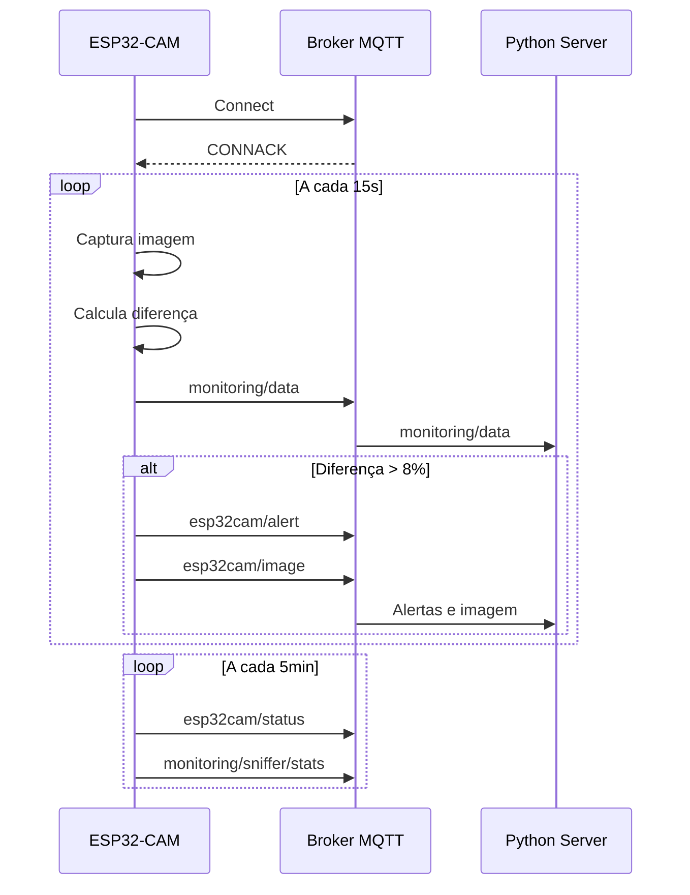
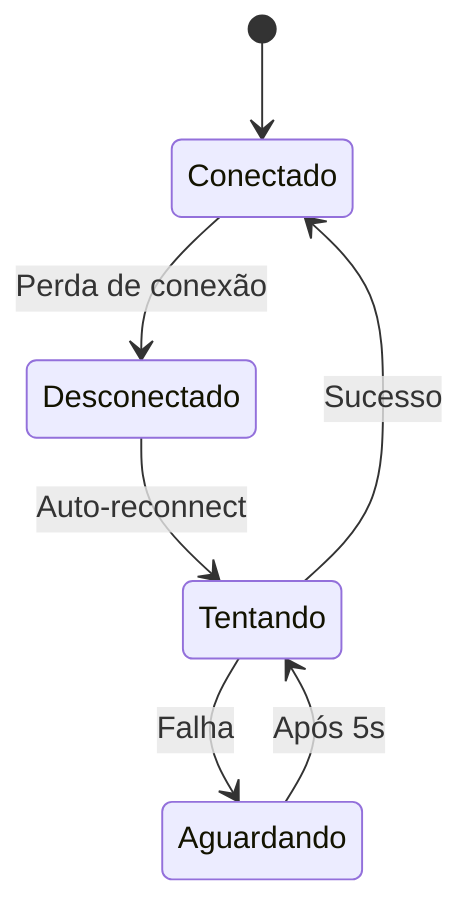

# 📡 API MQTT - Sistema de Monitoramento ESP32-CAM

Documentação completa do protocolo de comunicação MQTT utilizado no sistema.

## Visão Geral

O sistema utiliza MQTT v3.1.1 para comunicação entre ESP32-CAM e servidor. A escolha do MQTT se deve à sua eficiência em ambientes com largura de banda limitada e suporte nativo no ESP-IDF.

### Configuração do Broker

- **Protocolo**: MQTT v3.1.1
- **Porta padrão**: 1883 (sem TLS)
- **Autenticação**: Opcional (username/password)
- **Keep-alive**: 60 segundos
- **Clean session**: true

---

## Tópicos MQTT

### Estrutura de Tópicos

```
monitoring/
├── data            # Dados periódicos de monitoramento
├── image/
│   └── metadata    # Metadados de imagens (legado)
└── sniffer/
    └── stats       # Estatísticas do WiFi sniffer

esp32cam/
├── status          # Status do sistema
├── alert           # Alertas de mudanças significativas
├── image           # Imagens completas em base64
└── stats           # Estatísticas gerais
```

### Detalhamento dos Tópicos

| Tópico | QoS | Retain | Descrição |
|--------|-----|--------|-----------|
| `monitoring/data` | 1 | false | Dados principais de monitoramento |
| `esp32cam/alert` | 1 | false | Alertas críticos |
| `esp32cam/status` | 0 | false | Status do sistema |
| `esp32cam/image` | 1 | false | Imagens em base64 |
| `monitoring/sniffer/stats` | 0 | false | Estatísticas de rede |

---

## Formato das Mensagens

### monitoring/data
Dados periódicos de monitoramento enviados a cada captura.

```json
{
  "timestamp": 1704067200,        // Unix timestamp
  "device": "esp32_cam_001",      // ID do dispositivo
  "difference": 2.34,             // Diferença percentual
  "image_size": 6052,             // Tamanho da imagem em bytes
  "width": 320,                   // Largura em pixels
  "height": 240,                  // Altura em pixels
  "format": 4,                    // Formato (4 = JPEG)
  "location": "monitoring_esp32cam",
  "mode": "image_comparison"
}
```

### esp32cam/alert
Enviado quando mudança excede o threshold de alerta (padrão: 8%).

```json
{
  "timestamp": 1704067200,
  "device_id": "esp32_cam_001",
  "alert": "significant_change",   // Tipo do alerta
  "difference": 12.5,              // Percentual de mudança
  "location": "monitoring_esp32cam"
}
```

### esp32cam/status
Status do sistema enviado periodicamente.

```json
{
  "device_id": "esp32_cam_001",
  "timestamp": 1704067200,
  "free_heap": 145632,            // Heap livre em bytes
  "free_psram": 6291456,          // PSRAM livre em bytes (de 8MB total)
  "uptime": 3600                  // Uptime em segundos
}
```

### esp32cam/image
Imagem completa codificada em base64.

```json
{
  "device_id": "esp32_cam_001",
  "timestamp": 1704067200,
  "width": 320,
  "height": 240,
  "format": 4,                    // 4 = JPEG
  "size": 6052,                   // Tamanho original
  "image": "base64_encoded_data..." // Dados da imagem
}
```

### monitoring/sniffer/stats
Estatísticas do WiFi sniffer.

```json
{
  "timestamp": 1704067200,
  "device_id": "esp32_cam_001",
  "total_packets": 15234,         // Total de pacotes capturados
  "mqtt_packets": 234,            // Pacotes MQTT identificados
  "total_bytes": 1523456,         // Total de bytes
  "mqtt_bytes": 45678             // Bytes MQTT
}
```

---

## Fluxo de Comunicação

### Sequência Normal



### Reconexão Automática



---

## Exemplos de Código

### Publicar do ESP32

```c
// Enviar dados de monitoramento
cJSON *root = cJSON_CreateObject();
cJSON_AddNumberToObject(root, "timestamp", timestamp);
cJSON_AddStringToObject(root, "device", DEVICE_ID);
cJSON_AddNumberToObject(root, "difference", difference);
// ... outros campos

char *payload = cJSON_PrintUnformatted(root);
esp_mqtt_client_publish(mqtt_client, "monitoring/data", 
                       payload, 0, 1, 0);
cJSON_Delete(root);
free(payload);
```

### Subscrever no Python

```python
import paho.mqtt.client as mqtt
import json

def on_message(client, userdata, msg):
    topic = msg.topic
    payload = msg.payload.decode()
    
    if topic == "monitoring/data":
        data = json.loads(payload)
        print(f"Diferença: {data['difference']}%")
    elif topic == "esp32cam/alert":
        alert = json.loads(payload)
        print(f"ALERTA: {alert['alert']}")

client = mqtt.Client()
client.on_message = on_message
client.connect("localhost", 1883, 60)
client.subscribe("monitoring/+")
client.subscribe("esp32cam/+")
client.loop_forever()
```

### Teste Manual

```bash
# Subscrever em todos os tópicos
mosquitto_sub -h localhost -t '#' -v

# Publicar teste
mosquitto_pub -h localhost -t monitoring/data \
  -m '{"timestamp":1234567890,"device":"test","difference":5.2}'

# Simular alerta
mosquitto_pub -h localhost -t esp32cam/alert \
  -m '{"device_id":"test","alert":"significant_change","difference":15.0}'
```

---

## Configurações e Otimizações

### QoS (Quality of Service)

- **QoS 0**: Usado para status e estatísticas (perda aceitável)
- **QoS 1**: Usado para dados críticos e alertas (entrega garantida)
- **QoS 2**: Não utilizado (overhead desnecessário)

### Tamanho das Mensagens

| Tipo | Tamanho Típico | Máximo |
|------|----------------|---------|
| monitoring/data | 180-220 bytes | 512 bytes |
| esp32cam/alert | 120-150 bytes | 256 bytes |
| esp32cam/status | 100-120 bytes | 256 bytes |
| esp32cam/image | 8-12 KB | 32 KB |
| sniffer/stats | 150-200 bytes | 512 bytes |

### Otimizações Implementadas

1. **JSON compacto**: Uso de `cJSON_PrintUnformatted()`
2. **Campos mínimos**: Apenas dados essenciais
3. **Timestamp Unix**: Economia vs. strings de data
4. **Base64 eficiente**: Para transmissão de imagens
5. **Batch desabilitado**: Latência reduzida

---

## Segurança

### Implementado

- Autenticação básica (username/password)
- Validação de dados no servidor
- Timeout de conexão configurável

### Recomendações Futuras

- [ ] TLS/SSL (porta 8883)
- [ ] Certificados cliente
- [ ] ACL por tópico
- [ ] Rate limiting
- [ ] Payload encryption

---

## Monitoramento e Debug

### Logs do Broker

```bash
# Mosquitto com logs verbose
mosquitto -v

# Monitorar conexões
tail -f /var/log/mosquitto/mosquitto.log
```

### Análise de Tráfego

```bash
# Capturar tráfego MQTT
tcpdump -i any -w mqtt.pcap port 1883

# Analisar com Wireshark
wireshark mqtt.pcap
# Filtro: mqtt
```

### Métricas

- **Mensagens/segundo**: ~0.1 (normal), até 4 (com imagens)
- **Banda média**: 1.6-2.4 KB/s
- **Latência típica**: 120-200ms (rede local)
- **Taxa de perda**: < 0.1% com QoS 1

---

## 🔗 Referências

- [MQTT v3.1.1 Specification](http://docs.oasis-open.org/mqtt/mqtt/v3.1.1/mqtt-v3.1.1.html)
- [ESP-IDF MQTT Client](https://docs.espressif.com/projects/esp-idf/en/latest/esp32/api-reference/protocols/mqtt.html)
- [Paho MQTT Python](https://pypi.org/project/paho-mqtt/) 
